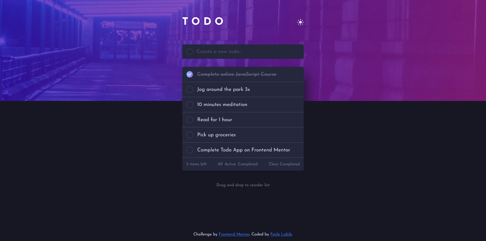

# Frontend Mentor - Todo app solution

This is a solution to the [Todo app challenge on Frontend Mentor](https://www.frontendmentor.io/challenges/todo-app-Su1_KokOW). Frontend Mentor challenges help you improve your coding skills by building realistic projects.

## Table of contents

- [Overview](#overview)
  - [The challenge](#the-challenge)
  - [Screenshot](#screenshot)
  - [Links](#links)
- [My process](#my-process)
  - [Built with](#built-with)
  - [What I learned](#what-i-learned)
  - [Useful resources](#useful-resources)
- [Author](#author)

## Overview

### The challenge

Users should be able to:

- View the optimal layout for the app depending on their device's screen size
- See hover states for all interactive elements on the page
- Add new todos to the list
- Mark todos as complete
- Delete todos from the list
- Filter by all/active/complete todos
- Clear all completed todos
- Toggle light and dark mode
- **Bonus**: Drag and drop to reorder items on the list

### Screenshot




### Links

- Solution URL: [https://github.com/FazleLabib/frontend-mentor-todo-app](https://github.com/FazleLabib/frontend-mentor-todo-app)
- Live Site URL: [https://fazlelabib.github.io/frontend-mentor-todo-app](https://fazlelabib.github.io/frontend-mentor-todo-app)

## My process

### Built with

- Semantic HTML5 markup
- CSS custom properties
- Flexbox
- Vanilla JavaScript

### What I learned

- Figured out how to use local storage.
- Learned about JavaScript's drag and drop functionality.
- Learned how to create circular gradient borders.

<!-- To see how you can add code snippets, see below: -->

<!-- ```html
<h1>Some HTML code I'm proud of</h1>
```
```css
.proud-of-this-css {
  color: papayawhip;
}
```
```js
const proudOfThisFunc = () => {
  console.log('🎉')
}
``` -->

### Useful resources

- [Circular Gradient Border](https://stackoverflow.com/questions/51496204/border-gradient-with-border-radius) - This is an article which helped me understand how to create the circular gradient border for the checkboxes.

## Author

- Frontend Mentor - [@FazleLabib](https://www.frontendmentor.io/profile/FazleLabib)
